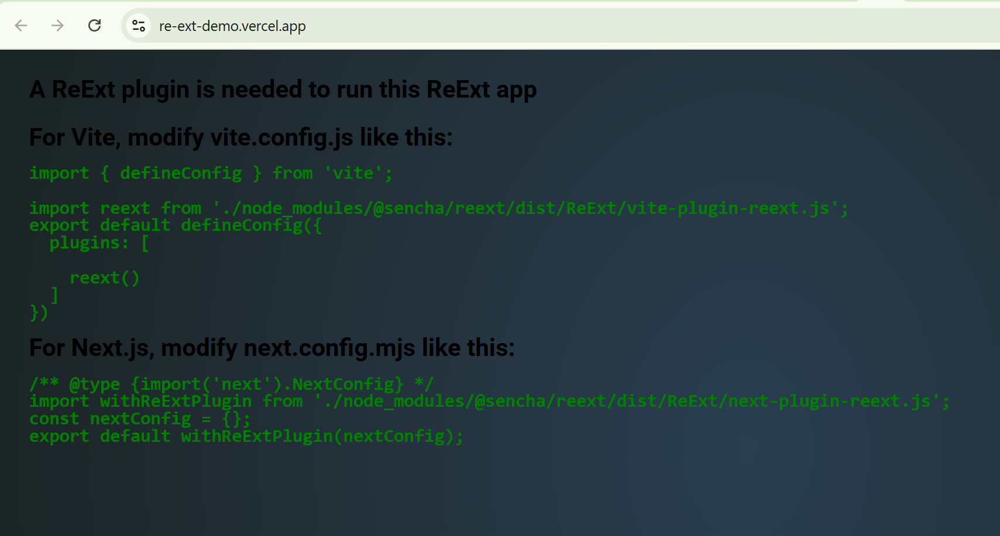

## ReExt Demo Project

This is a simple guide to set up and run the ReExt Demo project on your local machine.

Getting Started
Follow these steps to get the project up and running:

1. Clone the Repository
   Start by cloning the repository from Git to your local machine.
   Command: git clone <repository-url>
   Replace <repository-url> with the actual URL of your Git repository.

2. Navigate to the Project Directory
   Switch to the project folder by moving into the reext-demo directory.
   Command: cd reext-demo
   This changes your current working directory to reext-demo.

3. Install ReExt Package
   Install the @sencha/reext package using npm to set up the core dependency.
   Command: npm i @sencha/reext
   This installs the ReExt library specifically required for the project.

4. Install Project Dependencies
   Run the command to install all required dependencies listed in the project.
   Command: npm install
   This fetches and installs all packages defined in package.json.

5. Run the Development Server
   Launch the project in development mode and automatically open it in your browser.
   Command: npm run dev or npx vite --open
   npm run dev starts the development server, while npx vite --open uses Vite to serve the project and opens it in your default browser.

Running the Project

Once the setup is complete, the development server will start, and the project should open in your default web browser. You can also navigate to http://localhost:5173/ to view the ReExt Demo. now explore and interact with the ReExt Demo!

---

## Project Features and Screens

### Home Page (First Screen)

- **Overview**: The home page welcomes you with a visually appealing layout showcasing cryptocurrency market insights.
- **Top Market Leaders and Trending**:
  - Built using the **ReExt Carousel** and **Tab Panel** components to display tabs.
  - Highlights the top market leaders and trending cryptocurrencies in an interactive and user-friendly manner.
- **Market Top Gainers and Losers**:
  - Positioned below the carousel, this section uses the **ReExt Data View** and **ReExt Containers** for a responsive card-based layout.
  - Each card displays key details:
    - Crypto logo
    - Price
    - Volume
    - 24-hour price changes
  - The responsive design ensures seamless viewing across devices.

### Dashboard (Second Screen)

- **Access**: Click on the "Dashboard" option in the header to navigate to this screen.
- **Overview**: Displays data for 100 cryptocurrencies in a structured and interactive format.
- **Features**:
  - Utilizes the **ReExt Grid** component, offering powerful functionality such as:
    - Filtering
    - Searching
    - Auto-responsive layout
  - The grid adapts effortlessly to different screen sizes, enhancing usability.

### Crypto Chart (Third Screen)

- **Access**: Click on any row in the Dashboard’s ReExt Grid to view this screen.
- **Overview**: Provides a detailed chart for the selected cryptocurrency, powered by the **ReExt Cartesian** component.
- **Features**:
  - The chart header includes buttons to toggle data timeframes:
    - 7 Days
    - 30 Days
    - 3 Months
    - 1 Year
  - Clicking these buttons dynamically updates the chart to reflect the selected period’s data.
  - The chart visualizes price trends and other relevant metrics, offering an intuitive way to analyze cryptocurrency performance.

---

## Additional Notes

- **Responsiveness**: The entire web application is fully responsive, ensuring a smooth experience on desktops, tablets, and mobile devices.

I also deployed on vercel but getting some error related reExt licence key
like this:-
